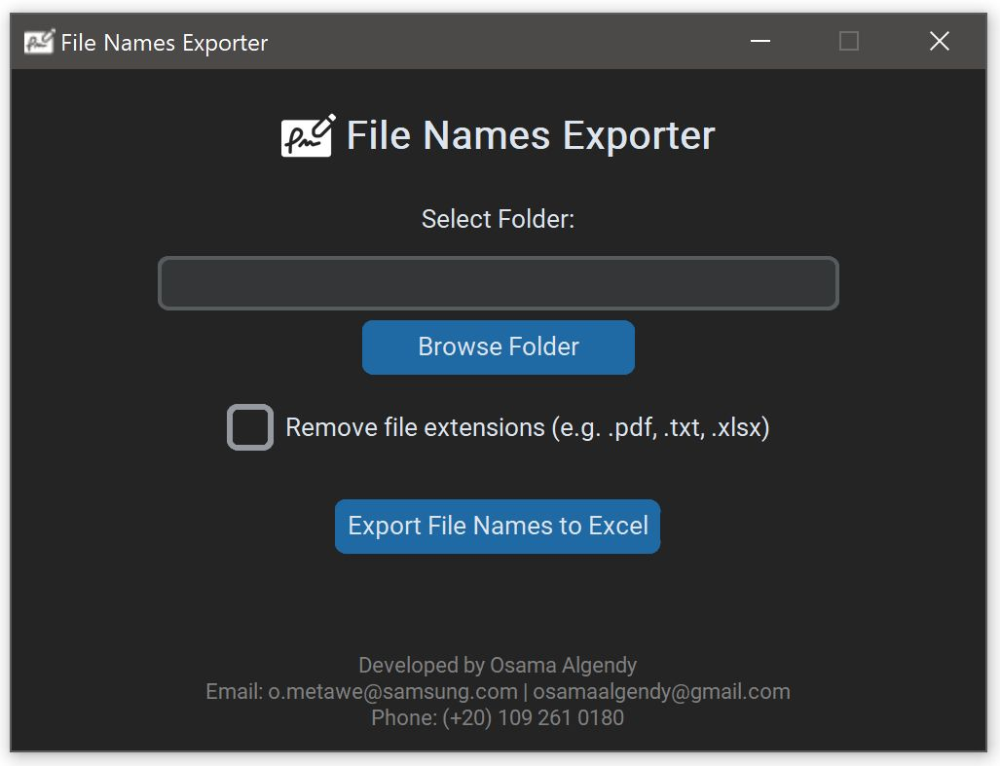

# 📂 File Names Exporter

**File Names Exporter** is a lightweight desktop app that allows you to easily export all file names from a selected folder into an Excel file.
It's perfect for organizing, reporting, or cataloging files in bulk.

---

## 🖥️ Screenshot

Here’s how the app looks in action:

---

## 📥 Download

You can download the latest version of the app for Windows:

➡️ [**Download File Names Exporter (Windows .exe)**](https://github.com/osamaalgendy/file-names-exporter/releases/download/v1/File-Names-Exporter.exe)

> No installation required — just download and run the `.exe` file.

---

## 🚀 Features

- Select any folder on your system
- List all file names (with or without file extensions)
- Save the list as an Excel `.xlsx` file
- Clean, modern dark-themed GUI
- No Excel required to run

---

## ⚙️ How It Works

1. Launch the app
2. Click **"Browse Folder"** and select the folder you want to extract file names from
3. (Optional) Check the box to **remove file extensions**
4. Click **"Export File Names to Excel"**
5. Choose where to save the `.xlsx` file
6. Done! 🎉 Your Excel file will include all file names in that folder

